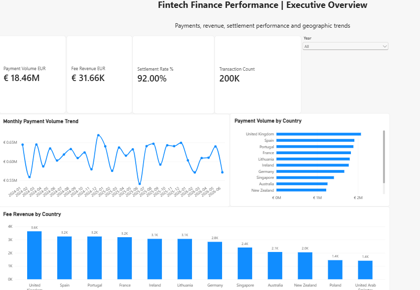
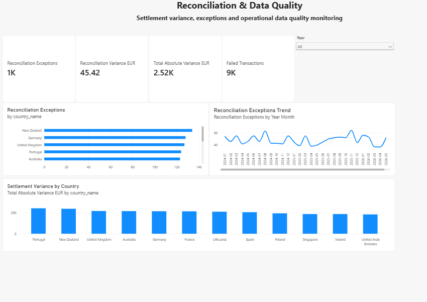
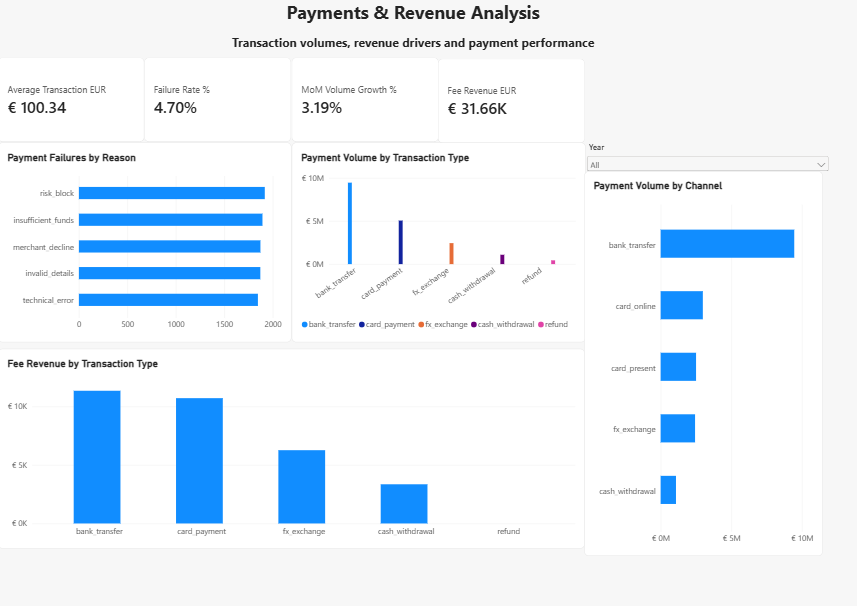
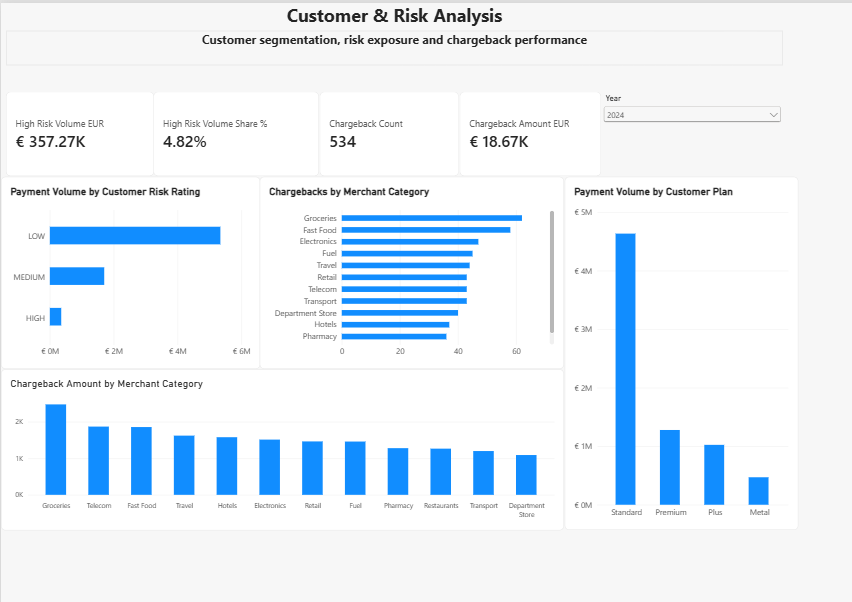

# Fintech Finance Analytics & Reconciliation Project 

An end-to-end fintech data analytics project analysing payment performance, fee revenue, settlement reconciliation, customer risk, and chargeback exposure using PostgreSQL, SQL, and Power BI.

The project transforms raw financial transaction data into a structured analytical model and an interactive four-page Power BI dashboard designed to support finance, operations, and risk decision-making.

## Dashboard Preview

*Executive Overview — interactive Power BI dashboard showing payment volume, fee revenue, settlement performance, transaction activity, and geographic trends.*

### Reconciliation & Data Quality

*Reconciliation monitoring dashboard highlighting settlement exceptions, financial variance, failed transactions, geographic patterns, and monthly trends.*

### Payments & Revenue

*Payments and revenue analysis covering payment failures, transaction types, payment channels, fee revenue, and month-over-month performance.*

### Customer & Risk Analysis

*Customer and risk analysis highlighting high-risk payment exposure, chargebacks, merchant-category risk, and customer plan performance.*

## Business Objective

The objective of this project is to analyse fintech transaction data and identify actionable insights across financial performance, payment operations, reconciliation, customer risk, and chargebacks.

The analysis focuses on understanding transaction performance, identifying operational exceptions, monitoring financial exposure, and providing decision-makers with clear KPIs and interactive reporting.

## Business Questions

This project aims to answer the following key business questions:

1. How much payment volume and fee revenue is being generated?
2. How is payment volume changing month over month?
3. Which countries contribute the most payment volume and revenue?
4. What percentage of transactions successfully settle?
5. What are the main reasons for payment failures?
6. Where are reconciliation exceptions occurring?
7. Which markets have the greatest settlement variance?
8. How much payment volume comes from high-risk customers?
9. Which merchant categories have the greatest chargeback exposure?
10. Which transaction types and channels drive payment volume and fee revenue?

## Tools & Technologies

- PostgreSQL — relational database and analytical data storage
- pgAdmin — database management and SQL development
- SQL — data validation, joins, aggregations, CTEs, window functions, reconciliation, and financial analysis
- Power BI — data modelling, DAX measures, interactive dashboards, and data visualisation
- DAX — financial KPIs, risk metrics, reconciliation measures, and time intelligence
- VS Code — project documentation and file management

## Dataset

The project uses a synthetic fintech dataset designed to simulate a digital banking and payments environment.

The analytical model includes customer, account, card, merchant, transaction, ledger, foreign exchange, and chargeback data.

The core transaction dataset contains 200,000 transactions across multiple countries, transaction types, payment channels, customer risk levels, and account types.

## Data Model

The PostgreSQL database was structured using a relational model with the transactions table serving as the central transactional dataset.

Key tables include:

- customers — customer location, plan, KYC status, and risk rating
- accounts — customer accounts, currencies, account types, and balances
- transactions — transaction amounts, fees, settlement values, status, channels, and failure reasons
- merchants — merchant information and merchant categories
- cards — customer card information and status
- chargebacks — disputed transactions and chargeback amounts
- ledger_entries — accounting ledger records linked to transactions
- fx_rates — currency conversion rates used within the financial dataset

## SQL Analysis

SQL was used to validate the dataset and perform the core financial analysis before building the Power BI dashboard.

The analysis included:

- Data quality and referential integrity checks
- Monthly finance KPI calculations
- Month-over-month payment volume analysis
- Payment failure and root-cause analysis
- Settlement reconciliation and exception detection
- Reconciliation analysis by country
- Country-level financial performance
- Customer risk segmentation
- Chargeback analysis by merchant category

## Power BI Dashboard

The Power BI report contains four interactive analytical pages:

1. **Executive Overview** — headline financial KPIs, monthly payment trends, country performance, and fee revenue.
2. **Reconciliation & Data Quality** — reconciliation exceptions, settlement variance, failed transactions, and exception trends.
3. **Payments & Revenue** — payment failures, transaction types, payment channels, fee revenue, and month-over-month performance.
4. **Customer & Risk** — customer risk exposure, chargebacks, merchant categories, and customer plan performance.

Interactive year filters allow users to analyse performance across 2024, 2025, and 2026.

## Key Findings

- Total settled payment volume reached approximately **€18.46 million** across the full analysis period.
- The business generated approximately **€31.66K in fee revenue**.
- The overall transaction settlement rate was approximately **92%**.
- The dataset contained **200,000 transactions**.
- The United Kingdom was the largest market by payment volume.
- **1,453 reconciliation exceptions** were identified, representing approximately **€2,524.07 in absolute settlement variance**.
- New Zealand recorded the highest number of reconciliation exceptions, while Portugal had the highest total settlement variance.
- High-risk customers accounted for approximately **€890.25K**, or **4.82% of settled payment volume**.
- The dataset contained **1,254 chargebacks**, representing approximately **€46.03K in chargeback value**.
- Fast Food showed the greatest chargeback exposure among the analysed merchant categories.
- Bank transfers were the leading transaction type for both payment volume and fee revenue.

## Business Recommendations

Based on the analysis, the following actions are recommended:

- Prioritise investigation of reconciliation exceptions in markets with high exception counts, particularly New Zealand.
- Monitor Portugal closely because its settlement discrepancies have a comparatively high financial impact.
- Investigate the main payment failure reasons and identify opportunities to improve payment success rates.
- Continue monitoring high-risk customer activity while maintaining appropriate risk controls.
- Review merchant categories with elevated chargeback exposure, particularly Fast Food.
- Protect and optimise high-performing markets such as the United Kingdom while investigating opportunities to grow other markets.
- Monitor bank transfer performance closely because it represents a major driver of both payment volume and fee revenue.

## Skills Demonstrated

- PostgreSQL database design and management
- SQL joins and aggregations
- Common Table Expressions (CTEs)
- Window functions and month-over-month analysis
- Financial reconciliation and exception analysis
- Data quality validation
- Customer and risk segmentation
- Payment and chargeback analysis
- Power BI data modelling
- DAX measure development
- Time intelligence
- Interactive dashboard development
- Financial KPI reporting
- Translating analytical findings into business recommendations

## Project Outcome

This project demonstrates an end-to-end analytics workflow, from relational database design and SQL analysis through to financial KPI development and interactive Power BI reporting.

The final solution provides a consolidated view of payment performance, revenue, reconciliation, operational exceptions, customer risk, and chargeback exposure to support data-driven decision-making.
